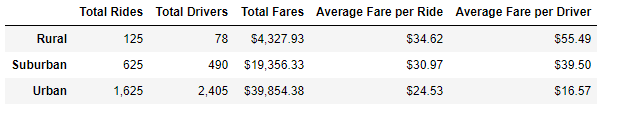
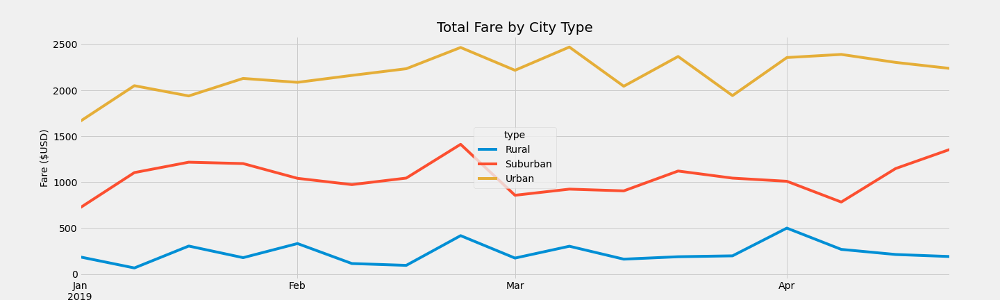

# Pyber Ride Sharing Analysis

## Project Overview

 Pyber is a ridesharing app company that is looking to perform exploratory analaysis on different data files containing ridership and revenue data. Specifically, we want to create visualizations and analysis that can tell a story about the data. This will help Pyber improve access to ride sharing services and determie affordability for under served communities. With this goal in mind, we will be anlayzing ride sharing data from January to early May of 2019 and providing analysis and recommendations based on the results. The following deliverables fall within the scope of this analysis.

- Deliverables:
1. Summary dataframe that shows the relationship between the type of city and the number of drivers and riders as it relates to fares
2. Create a multi-line graph showing total weekly fares for each city type

## Resources
- Data Source: city_data.csv, ride_data.csv
- Software: Python 3.7.10, Visual Studio Code 1.56.2, Jupyter Notebook Server 6.3.0

## Results

### Analysis of Deliverable 1

 The dataframe shows the majority of income is tied to our urban clients and drivers and it appears that the city's demographic is being well served by the ride sharing services of Pyber. However, this groups also has the smallest average fare per ride and also per driver which might indicate that we have more urban drivers than are necessary. For rural communities, they have the smallest revenue but produces the most profitable revenue in fare averages per rider and per driver. Suburban communities fall somewhere in between these other groups and appears to be in more of a sweet spot with fares and and drivers with respect to the total ride sharing services provided by Pyber.

### Analysis of Deliverable 2

 The chart below again identifies that our urban clients are most responsible for the income at Pyber. Where the rural fares are considerably lower on a monthly basis. The monthly fare revenue amongst the threee communities appears to all have different patterns based on the chart with not much corelation. It would be beneficial for Pyber to focus on increasing ride sharing services to rural communities right away and to a lesser extent suburban communities as well. Pyber also needs to maintain or increase if possible the revenue from urban communities in general.

## Overall Summary

 Based on the analysis above and charts provided, we can see that rural communities are likely underserved and need more access to ride sharing services from Pyber. Also, our urban drivers have a ratio of 1 driver for every 0.68 rides which likely accounts for the lowest fare per driver in these communities. If we were to decrease the number of urban drivers, we can proportionally increase the fares to keep revenue at the current levels and improve this ratio comparatively to other city types. For rural communities more drivers are needed to enhance ride sharing services to this demographic that has the highest average revenue per ride. Therefore, the following recommendations are a direct result of the data analysis and visualizations prepared for this project.

 Recommendations:
 1. Decrease the number of urban drivers
 2. Increase the fare in urban communities in tandem with #1 above
 3. Increase the number of rural drivers